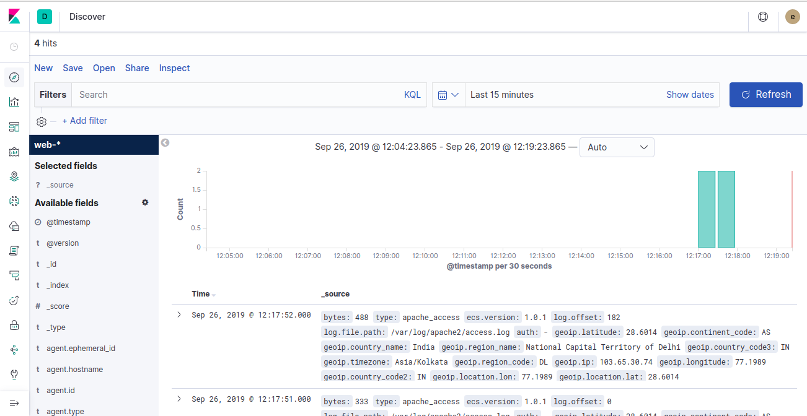

# Elasticsearch (ELK) stack on Docker

The main goal for creating this stack was to provide the environment of ELK(Elasticsearch, Logstash and Kibana) for different types of POCs. :slightly_smiling_face:

In the end result you will get a kibana dashboard like this:



We are using the official image from Elastic:-

- **[Elasticsearch](https://github.com/elastic/elasticsearch/tree/master/distribution/docker)**
- **[Kibana](https://github.com/elastic/kibana/tree/master/src/dev/build/tasks/os_packages/docker_generator)**
- **[Logstash](https://github.com/elastic/logstash/tree/master/docker)**

This compose setup will setup these things for you:-

- [X] **Elasticsearch**
- [X] **Kibana**
- [X] **Logstash**

## Requirements

- **[Docker](https://docs.docker.com/install/)** version
- **[Docker Compose]()** version

## Overview

```s
├─docker
├─── .env           ---> Environment Variabes 
├─── elasticsearch  ---> Dockerfile and configuration file for elasticsearch
├─── kibana         ---> Dockerfile and configuration file for kibana
└─── logstash       ---> Dockerfile and configuration file for logstash
    └─── conf.d     ---> Logstash configuration for beats, filter and outputs
```

This setup will expose these ports:-

- 9200: Elasticsearch HTTP endpoint
- 9300: Elasticsearch TCP endpoint
- 5601: Kibana UI
- 5000: Logstash TCP input
- 9600: Logstash input

## Usage

#### Bringing Up

```shell
docker-compose up -d
```

#### Clean Up

```shell
docker-compose down -v
```

After this steps, now you can go and login into kibana and visualize your logs:-

- Kibana Url:- *http://<your_ip>:5601*
- Username:- elastic (optional)
- Password:- elastic (optional)

## Security
If you want to secure Elasticsearch uncomment the last to lanes form the config file inside the following folder:
```shell
elasticsearch/elasticsearch.yml
```

## Storage
Since we are using Docker, we need to create a volume for storing the Elasticsearch data and preserve it even if the container is restarted, just uncomment the volumes lines inside the **docker-compose.yml** file